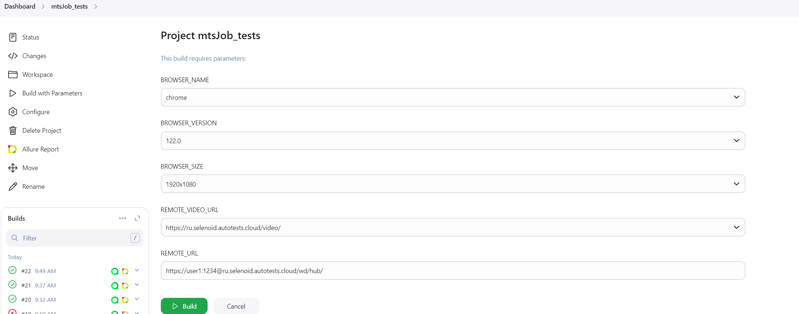
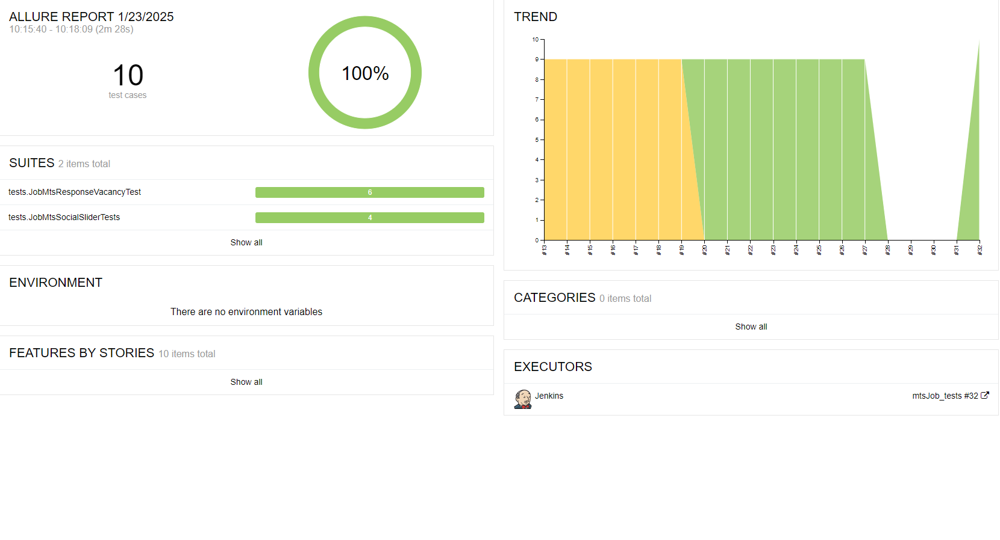

# Тесты для сайта job.mts.ru


## Содержание

* <a href="#tests">Что проверяют тесты?</a>
* <a href="#jenkins">Jenkins</a>
* <a href="#allure">Отчет в Allure</a>
* <a href="#telegramBot">Уведомления в Telegram bot</a>
* <a href="#video">Видео прохождения тестов</a>

---
## <a name="Технологии:">**Технологии:**</a>

<p align="center">  
<a href="https://www.jetbrains.com/idea/"></a>  
<a href="https://www.java.com/"></a>  
<a href="https://github.com/"></a>  
<a href="https://junit.org/junit5/"></a>  
<a href="https://gradle.org/"></a>  
<a href="https://selenide.org/"></a>  
<a href="ht[images](images)tps://github.com/allure-framework/allure2"></a>  
<a href="https://www.jenkins.io/"></a>  
<a href="https://aerokube.com/selenoid/"></a>  
</p>

---
<a id="tests"></a>
## <a name="Что проверяют тесты?">**Что проверяют тесты?**</a>

5 тестов на проверки верхнеуровнего функционала [сайта](https://job.mts.ru/). Тесты проверяют кликабельность кнопок.

---

<a id="tools"></a>
## <a name="Jenkins:">**Jenkins:**</a>

Тесты запускаются через [Jenkins](https://jenkins.autotests.cloud/job/student_alabzin_testOps_in_jenkins/)



Для запуска тестов необходимо нажать на кнопку "Build with Parameters". Появится прогресс бар с номером сборки тестов.

---
## Команды для запуска из терминала
___
***Локальный запуск:***
```bash  
gradle clean runing_test
```

***Удалённый запуск через Jenkins:***
```bash  
clean runing_test
"-DbrowserSize=${BROWSER_SIZE}"
"-DbrowserName=${BROWSER_NAME}"
"-DbrowserVersion=${BROWSER_VERSION}"
"-Dremote=${REMOTE_URL}"
"-Dlogin=${REMOTE_LOGIN}"
"-DremoteVideoURL=${REMOTE_VIDEO_URL}"
```
---

<a id="allure"></a>
## <a name="Отчет в Allure">**Отчет в Allure**</a>

После окончания прогона тестов формируется отчет [Allure](https://jenkins.autotests.cloud/job/student_alabzin_testOps_in_jenkins/6/allure)
### На скриншоте результаты отчета пяти тестов:


Есть возможность просмотреть более детальный отчет, нажав на тестовый набор и откроются названия всех тестов



При нажатии на определенный тест, раскрываются шаги теста с приложенными вложениями


---

<a id="telegramBot"></a>
## <a name="Уведомления в Telegram bot">**Уведомления в Telegram bot**</a>

Для быстрой визуализации отчетности, после выполнения тестов, результат отчета дублируется в Telegram бот:
<p align="center">
    
</p>

---

<a id="video"></a>
## <a name="Видео прохождения тестов">**Видео прохождения тестов**</a>

<p align="center">
   
</p>